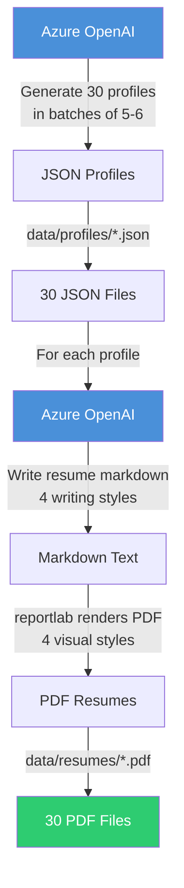
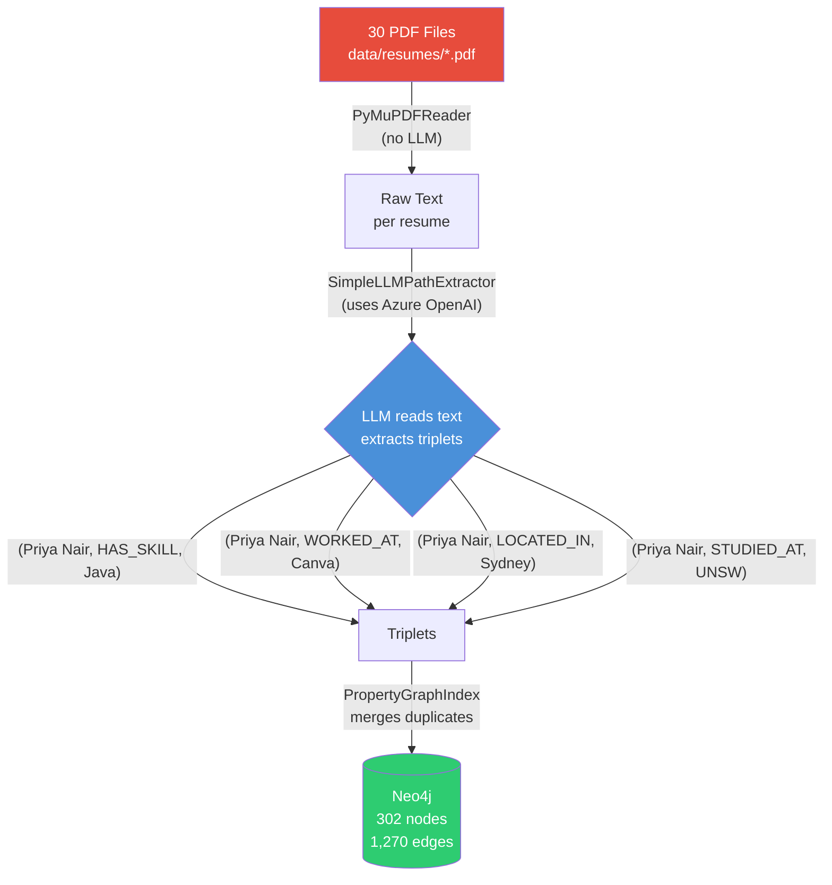
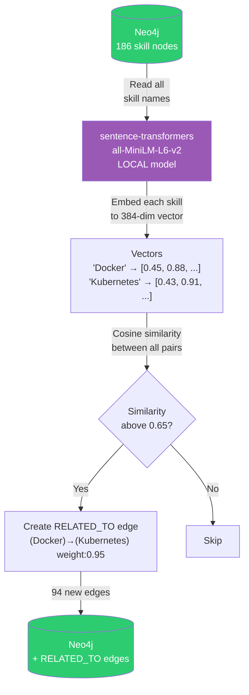
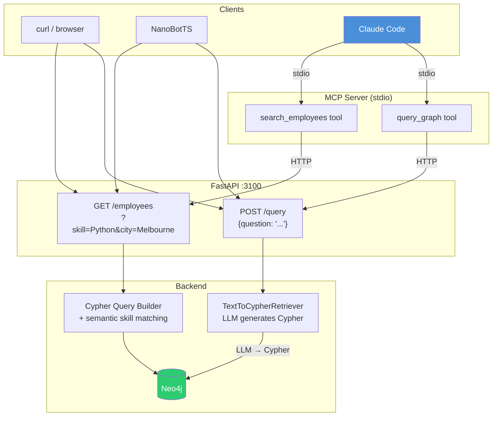
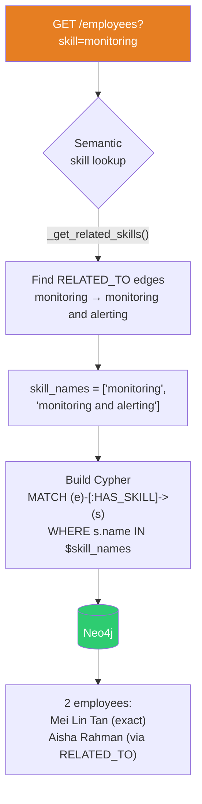
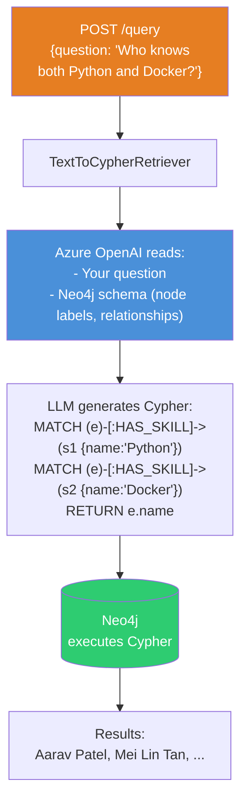
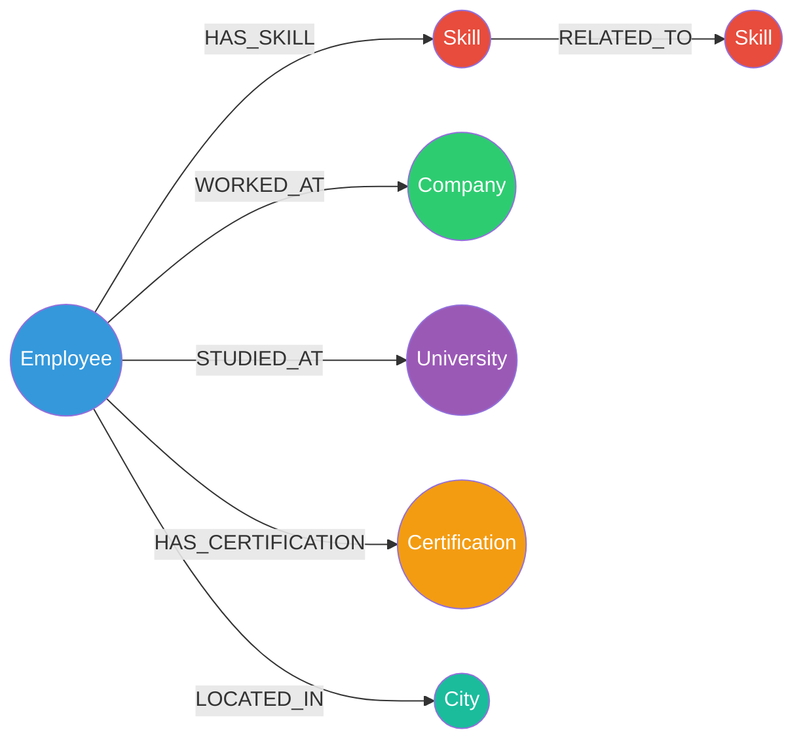
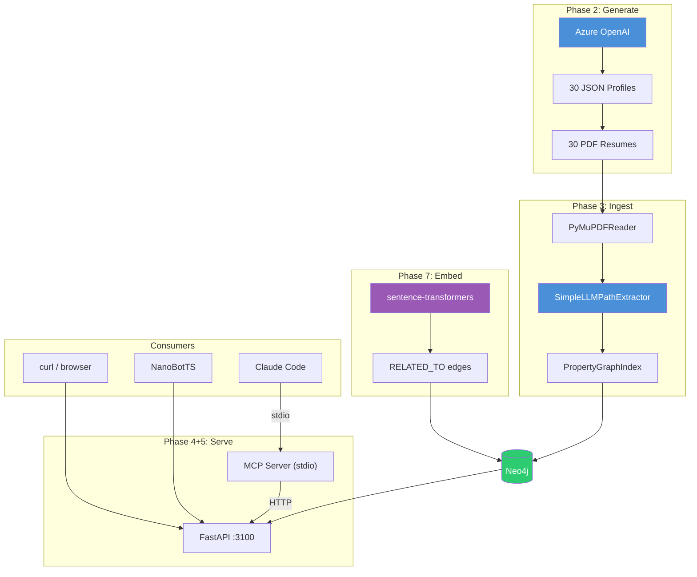

# ResumeGraph — System Flow

## 1. Data Generation Pipeline

**CLI:** `uv run python -m resume_graph.generate`

---

## 2. Ingestion Pipeline (PDF to Graph)

**CLI:** `uv run python -m resume_graph.ingest`

---

## 3. Embedding Pipeline (Post-processing)

**CLI:** `uv run python -m resume_graph.graph.embeddings`

---

## 4. Query Flow — API Server

---

## 5. GET /employees — Structured Query Flow

---

## 6. POST /query — Natural Language Flow

---

## 7. Graph Model

---

## 8. Full System Overview

